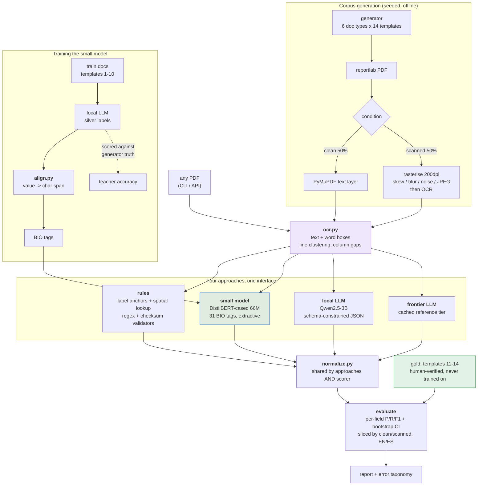

# Document Intelligence: NLP vs a small model vs LLMs

Extracts 15 fields and a document type from semi-structured healthcare documents
(referrals, prior-auth requests, lab orders, CMS-1500 claims, EOBs, intake forms), four
different ways, and scores them all on the same held-out test set.

Read [REPORT.md](REPORT.md) for the results and the argument. This file is how to run it.

## Results

| approach | F1 | accuracy | doc type | service lines | latency | size | cost/doc | offline | deterministic |
|---|---|---|---|---|---|---|---|---|---|
| rules | 0.825 | 0.705 | 0.911 | 0.000 | 11 ms | 6 MB | $0 | yes | yes |
| small model (DistilBERT 66M) | 0.782 | 0.647 | 0.800 | 0.013 | 52 ms | 525 MB | $0 | yes | yes |
| local LLM (Qwen2.5-3B) | 0.842 | 0.728 | 0.833 | 0.701 | 8,385 ms | 1.9 GB | $0 | yes | no |
| frontier LLM | 0.960 | 0.923 | 1.000 | 0.917 | — | — | $0.0067 | no | no |

90 gold documents, human-verified, built from layout templates nothing was trained on.

Two columns carry most of the argument. **Rules get 86% of frontier F1 for 6 MB and 11 ms**
— and score **0.000 on service lines**, the repeating `{procedure, date, units, charge, paid}`
rows on claims, which they structurally cannot do. Flat fields and structured tables are
different problems with different right answers.

## Quick start

Everything is already built and trained — these run against the committed artefacts.

```bash
# what's available on this machine
python -m docintel doctor

# one document through several approaches
python -m docintel extract --file data/corpus/pdfs/demo-0000-referral_letter-t11.pdf \
    --approach nlp small_model

# the demo: 10 documents nothing was trained or tuned on
python scripts/demo_unseen.py

# reproduce the results table
python -m docintel evaluate --split gold_synth --approach nlp small_model llm_frontier
python -m docintel evaluate --split gold_synth --approach llm_local --merge

# tests
python -m pytest tests/ -q
```

The latency a single `extract` prints includes loading the model — about 19 s for the
small model, against 52 ms warm. The table above is the warm figure, which is what a
served system would see; `evaluate` loads once and measures per document.

Two `evaluate` passes because this machine has 7.4 GB of RAM and can't hold torch and
Ollama at the same time. `--merge` combines them into one report. On a bigger machine
`--approach all` works in one go.

### The HTTP API

```bash
python -m uvicorn docintel.api:app --port 8000
```

```bash
curl.exe -F "file=@data/corpus/pdfs/demo-0000-referral_letter-t11.pdf" \
     "http://127.0.0.1:8000/extract?approach=all"
```

On Windows use `curl.exe`, not `curl` — PowerShell aliases `curl` to `Invoke-WebRequest`,
which has no `-F` flag and gives a confusing error about an unmatched parameter.

`Invoke-RestMethod -Form` is the native equivalent, but it needs **PowerShell 7+**; Windows
PowerShell 5.1, which is what ships with Windows, doesn't have the parameter at all. On 5.1
use `curl.exe` — it's present on every Windows 10/11 install.

```powershell
# PowerShell 7+ only
$f = Get-Item data\corpus\pdfs\demo-0000-referral_letter-t11.pdf
Invoke-RestMethod -Uri "http://127.0.0.1:8000/extract?approach=nlp" -Method Post -Form @{ file = $f }
```

`GET /health` reports which approaches loaded. An approach that failed to load returns
`200` with a reason rather than taking the request down.

## Rebuilding from scratch

```bash
# 1. corpus: 1,300 PDFs, half re-OCR'd through simulated fax degradation
python scripts/build_corpus.py --out data/corpus --seed 20250902

# 2. silver labels from the local LLM (~3.5 h on a 4 GB GPU, caches per document)
python scripts/make_silver.py --splits train val

# 3. gold verification — needs a person
python scripts/review_gold.py --split gold_synth --reset

# 4. train  (release the GPU from Ollama first -- see below)
ollama stop qwen2.5:3b-instruct
python -m docintel train --what all

# 5. score
python -m docintel evaluate --split gold_synth --approach all
python scripts/error_analysis.py --split gold_synth

# 6. determinism, which evaluate does not measure on its own
for a in nlp small_model llm_local llm_frontier; do
    python scripts/measure_determinism.py --approach $a --sample 5
done
```

Step 6 is easy to skip and shouldn't be: `evaluate` rewrites the report and leaves the
determinism fields null, so the numbers in section 6 of the report only appear after
`measure_determinism.py` has run against the report `evaluate` just wrote. Run it last.

Steps 1 and 2 are the slow ones and both cache per document, so an interrupted run picks
up where it left off rather than repeating inference you've already paid for.

## How it fits together



Two things this encodes:

**One interface, four implementations.** Every approach is
`extract(OcrDocument) -> ExtractionResult`, so the CLI, API and evaluator can't
accidentally treat one specially.

**Normalisation is shared between the approaches and the scorer.** One `normalize.py`
decides that `03/14/2025`, `14-Mar-2025` and `2025-03-14` are the same date. If each
approach normalised its own output, whichever happened to emit the scorer's preferred
format would win for a reason unrelated to extraction quality.

## Layout

```
docintel/
  schema.py           pydantic models shared by everything
  ocr.py              PDF -> text + word boxes (clean and scanned paths)
  normalize.py        date/amount/org/code normalisers, used by approaches AND scorer
  align.py            value -> character span (exact / whitespace / compact / fuzzy)
  approaches/         nlp.py, small_model.py, llm_local.py, llm_frontier.py
  eval/               metrics, bootstrap CIs, slicing
  cli.py  api.py      the two entry points
  gen/                the document generator
scripts/              corpus build, silver labelling, training curve, review, demos
data/                 corpus, silver labels, gold set, frontier cache
models/               trained checkpoints
reports/              eval JSON, error CSV, learning curve
tests/                108 tests
```

## Things worth knowing before you read the numbers

**The corpus is synthetic.** There's no public set of labelled healthcare faxes and real
ones are PHI, so I generate them. Real documents have handwriting, stamps and multi-page
threading this doesn't produce, and absolute scores would drop on them. What holds up is
the *relative* comparison: all four approaches see identical documents, layouts nothing
was trained on, and real OCR damage.

**There's a ceiling no model can cross.** Only 85.3% of gold values survive OCR on the
scanned half (98.9% on the clean half). The rest were destroyed before any extractor ran.
Read every scanned-condition number against 85.3%, not 100%. Those errors are classified
`OCR_CORRUPTION` and never charged to a model.

**The frontier tier isn't reproducible by a third party.** It's a cached reference point
annotated through Claude Code, and its cost/document is estimated from published pricing,
never metered. The code records this and the evaluator carries it into every table.

**Dates are read US-first** — `03/04/2025` is 4 March. These are US healthcare documents
(NPI, CPT, CMS-1500). Genuinely ambiguous slash dates are counted so the exposure is
quantified rather than assumed away.

**It fails confidently on out-of-distribution documents.** I ran a real blank CMS-1500
from cms.gov through it and got garbage at confidence 0.90–1.05. The confidence scores are
per-rule constants, not calibrated probabilities. That's a real gap and the report treats
it as one.

## Three leaks I found and closed

Each would have quietly flattered a result:

1. **The rules approach imported the generator's own label dictionary**
   (`from ..gen.render import LABELS`), giving it perfect foreknowledge of wording that
   only appears on held-out templates. It now builds its vocabulary from training
   documents alone — and five label variants it consequently doesn't know are a real
   finding about dictionary brittleness, not a bug to patch.

2. **The evaluator marked every gold record `human_verified`** whether or not anyone had
   looked at it, because it keyed on presence in the file rather than the record's own
   flag.

3. **OCR assembly collapsed two-column rows to a single space**, making
   `Patient Name:` / `Reference #:` indistinguishable from prose and merging values from
   adjacent columns into one field.

`tests/test_no_leakage.py` guards all three.

## Environment

Built on Windows 11, Python 3.12, RTX 3050 (4 GB VRAM), 7.4 GB RAM.

```bash
pip install torch --index-url https://download.pytorch.org/whl/cu128
pip install transformers accelerate scikit-learn spacy rapidfuzz seqeval datasets \
            fastapi "uvicorn[standard]" python-multipart reportlab pymupdf pdfplumber
python -m spacy download en_core_web_sm
winget install --id Ollama.Ollama
ollama pull qwen2.5:3b-instruct
```

`python -m docintel doctor` reports what's present. Every approach degrades
independently, so a missing component disables only that approach.

### Stages have to run one at a time here

With 7.4 GB of RAM, silver labelling and training can't overlap. Training while the local
LLM is loaded fails with:

```
OSError: [WinError 1455] The paging file is too small for this operation to complete.
Error loading "torch\lib\curand64_10.dll"
```

This isn't a CUDA problem and `DOCINTEL_DEVICE=cpu` doesn't avoid it — the `+cu128` wheel
maps its CUDA DLLs at import time regardless of which device it computes on, and that
reservation fails when the system commit charge is nearly exhausted. Measured during
silver generation: 1.1 GB of 7.4 GB free. The same import succeeds once the LLM idles.

The same constraint appears again on the GPU side, and there it needs an explicit action.
Ollama keeps a model resident for 5 minutes after its last request, so `train` started
straight after `make_silver` finds 2.2 GB of the 4 GB VRAM already taken and dies with:

```
torch.AcceleratorError: CUDA error: unknown error
```

`ollama stop qwen2.5:3b-instruct` releases it immediately; `ollama ps` shows what's
resident. Waiting five minutes works too.

So the pipeline is sequenced deliberately rather than by preference:

```
build_corpus -> make_silver (GPU: Ollama) -> ollama stop -> train (GPU: torch) -> evaluate
```

Both slow stages cache, so this costs wall-clock and nothing else. With more RAM the
constraint disappears.
